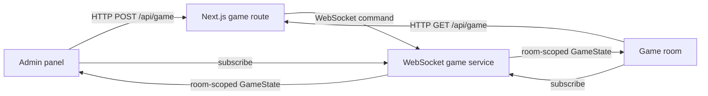

# Architecture

## Overview

Bingo is a Next.js App Router application backed by a separate Node WebSocket service. The WebSocket service owns the in-memory game state for every room. The Next.js HTTP route provides a validated command and snapshot interface, while browser clients receive live updates by subscribing directly to the service.

## Runtime components

| Component | Location | Responsibility |
|---|---|---|
| Next.js pages | `src/app/` | Renders `/game-room`, `/admin-panel`, and `/player-card`; `/` redirects to the game room. |
| HTTP game route | `src/server/api/game/route.ts` | Validates public API calls and proxies them to the WebSocket service. Re-exported at `src/app/api/game/route.ts`. |
| Game service | `src/server/ws-server.ts` | Creates, stores, mutates, and broadcasts isolated room sessions. Listens on `WS_PORT` or `3001`. |
| Session hook | `src/lib/useGameSession.ts` | Fetches an initial state from the HTTP API and sends a WebSocket `subscribe` message for updates. |
| Game-domain modules | `src/lib/` | Defines variants, number selection, card generation, room normalization, and Bingo-claim validation. |

## Rooms and state

The `room` browser query parameter corresponds to the API and WebSocket `sessionId`. `normalizeRoomId` accepts lower-case IDs of up to 32 characters containing letters, numbers, and hyphens; invalid or omitted values become `default`.

Each `GameState` contains a session ID, display name, variant, ordered `drawnNumbers`, status, and optional verified Bingo line. Its status changes from `waiting` to `in-play` when a number is called and becomes `complete` only after a draw is requested when no numbers remain. A reset keeps the variant but clears all calls. Changing a variant also clears all calls.

The service keeps sessions in a process-local `Map`. It does not use a database, so service restarts discard room sessions, their names, and their history. It also has no authentication or authorization mechanism.

## Client surfaces

| Route | Behavior |
|---|---|
| `/game-room` | Shows a selectable room, current variant/status/count, theme toggle, large caller display, number board, verified Bingo announcement, and full reverse-chronological draw history. |
| `/admin-panel` | Lets callers select or create rooms, draw or manually call a number, change variant, reset, verify a five-number Bingo line, and view five recent calls. `Space` draws and `R` resets outside form fields. |
| `/player-card` | Generates card sets for a selected 75-ball or 90-ball room. It loads the room directory to use the selected display name as the printed card-set name and its variant as the card layout, but does not subscribe to the room or automatically mark calls. |

`Board.tsx` is one conditional-layout component for 90-ball, 75-ball, and Speedy Bingo boards. `CallerDisplay.tsx` uses a polite live region for the current number. `ThemeToggle.tsx` stores the selected light or dark theme in browser local storage.

## Deployment

Docker Compose runs `web` and `ws-server` as separate containers. The web container reaches the service through `GAME_SERVER_WS_URL=ws://ws-server:3001`. Browsers connect either through `NEXT_PUBLIC_WS_URL` or the current page hostname on port `3001`, using `wss` when the page uses HTTPS.

For exact request, response, and WebSocket message contracts, see [../shared/flow-webservice-api-reference.md](../shared/flow-webservice-api-reference.md).
